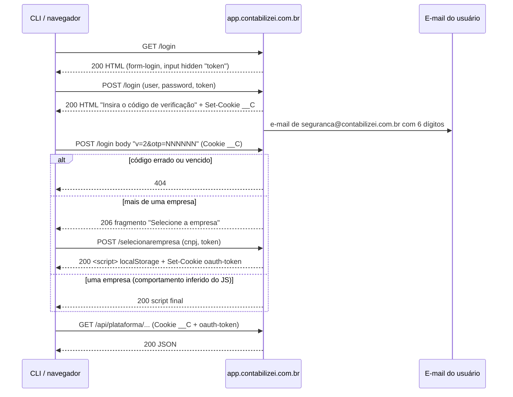

# Autenticação

O login da Contabilizei é **server-side, baseado em formulários HTML e cookies**: não
existe endpoint JSON de login nem token Bearer. A CLI reproduz exatamente o que o
navegador faz, em quatro etapas:

| # | Etapa | Documento |
|---|---|---|
| 1 | Formulário de usuário e senha | [01-credenciais.md](01-credenciais.md) |
| 2 | Código de verificação (OTP) enviado por e-mail | [02-otp.md](02-otp.md) |
| 3 | Seleção da empresa (quando o usuário tem mais de uma) | [03-selecao-de-empresa.md](03-selecao-de-empresa.md) |
| 4 | Cookies, dados de sessão (`localStorage`) e expiração | [04-sessao-e-cookies.md](04-sessao-e-cookies.md) |

## Sequência

## Pontos de atenção

- **Um código por login.** Cada `POST /login` com credenciais gera e envia um código
  novo; códigos anteriores deixam de valer. Dois logins seguidos geram dois e-mails
  quase simultâneos e é fácil usar o errado (aconteceu durante a investigação).
- **Limite de sessões simultâneas.** O servidor pode recusar com `#limite-sessoes`.
  Não há endpoint de logout no servidor (ver [04](04-sessao-e-cookies.md)), então
  logins repetidos em sequência devem ser evitados.
- **Bloqueio temporário.** Muitas tentativas erradas levam a `#bloqueado`. A CLI
  nunca repete automaticamente um OTP recusado.
- **Login com Google** existe (`/loginGoogle?token=…`), mas não foi explorado: a CLI
  usa apenas usuário/senha.
