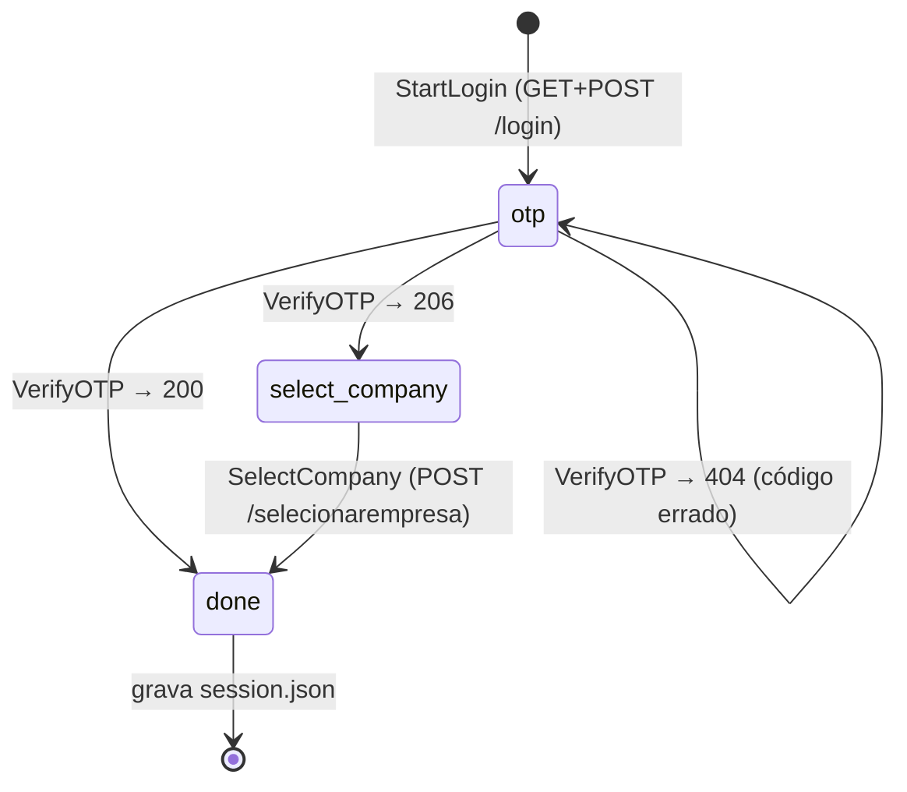

# CLI (`ctbz`)

Uso e instalação estão no [README principal](https://github.com/edusouza/ctbz-cli/blob/main/README.md). Aqui fica o funcionamento
interno.

## Estrutura

```text
cmd/ctbz/
  main.go        só chama cli.Execute (versão injetada por -ldflags)
internal/cli/
  root.go        árvore Cobra, flag global -o, códigos de saída, ajuda em português
  login.go       comando login: retomada, fontes de OTP, escolha de empresa
  session.go     chamadas autenticadas (re-login automático), dados da sessão
  status.go, empresa.go, api.go, logout.go, version.go   um arquivo por comando
  docs.go        gerador da referência de comandos (docs/referencia)
internal/api/
  api.go         Getter, registro de endpoints (Endpoints) para os contratos
  empresa.go     caminhos, tipos de resposta e BuscarXxx de um contexto
  testdata/      fixtures anonimizadas (go run ./tools/capture)
internal/contract/
  contract.go    verificação de contrato por reflexão (removido, tipo mudou, novo)
  anon.go        anonimização das fixtures
internal/ctbz/
  client.go      HTTP: cookies manuais, redirecionamentos manuais, API(), erros
  login.go       etapas do login e parsers de HTML/localStorage
  session.go     persistência (session.json, pending.json)
internal/otp/
  otp.go         extração de 6 dígitos, comando com polling, prompt
internal/output/
  output.go      formatos, List, Record, Scalar e Write
  values.go      tipos de valor (Money, Date, DateTime, CNPJ) e formatação por formato
  render.go      renderizadores: tabela alinhada, JSON ordenado, CSV
  fromjson.go    JSON arbitrário → List/Record (ordem dos campos e números preservados)
tools/gendocs/   regenera docs/referencia
tools/capture/   grava fixtures anonimizadas para os contratos
scripts/
  otp-gmail-gws.sh       OTP a partir do Gmail (gws)
  extrair-endpoints.py   gera docs/api/catalogo.md
```

Dependências: [Cobra](https://github.com/spf13/cobra) para a árvore de comandos
([ADR-0008](../adr/0008-cobra-para-a-arvore-de-comandos.md)) e `golang.org/x/term` para
detectar terminal. A versão de `x/term` está fixada em `v0.30.0` para manter o mínimo em
Go 1.24; versões mais novas exigem Go 1.26.

## Como adicionar um comando

1. Criar `internal/cli/<comando>.go` com `func newXxxCmd() *cobra.Command` e registrá-lo em
   `NewRootCmd` (ou no comando pai).
2. `Short` curto no imperativo/descritivo, `Long` e `Example` em português.
3. Ler a API com uma função de `internal/api` (`api.BuscarXxx(ctx, sessionGetter{s})`,
   ver [Testes de contrato](../contratos.md)) e montar um `output.Record`
   ou `output.List` ([ADR-0006](../adr/0006-saida-padronizada.md)); escrever com
   `output.Write(s.out, formato, dados)`, formato vindo de `outputFormat(cmd, "")`.
4. Testes com `execCLI` e `fakeAPI` (ver `internal/cli/output_test.go`).
5. `go run ./tools/gendocs` e entrada no `CHANGELOG.md`.

## Máquina de estados do login



`LoginState` (stage, token anti-CSRF, cookies, e-mail mascarado, horário do envio,
empresas) é serializável. Sempre que falta uma entrada (OTP ou CNPJ) e não há terminal
nem `CTBZ_OTP_CMD`, o estado vai para `pending.json` e o processo sai com código 3. A
próxima chamada com `--otp` ou `--cnpj` retoma do ponto exato, com os mesmos cookies.

Regras de retomada (`internal/cli/login.go`):

- `--otp N` só faz sentido retomando: sem login pendente, é erro (o código pertence ao
  login que o gerou).
- `--cnpj X` retoma um login pendente na etapa de seleção de empresa; em qualquer outro
  caso, inicia um login novo já com a empresa definida.
- `--restart` descarta o pendente e começa de novo (novo e-mail).
- O OTP vindo da linha de comando é usado uma única vez; se for recusado, o login
  continua pendente para outra tentativa.

Ordem das fontes de OTP: `--otp` → `--otp-cmd`/`CTBZ_OTP_CMD` → prompt (se stdin for
terminal) → pendente.

## Arquivos de estado

Em `$CTBZ_HOME` (padrão `~/.config/ctbz`), diretório `0700`, arquivos `0600`, gravados
de forma atômica (arquivo temporário seguido de `rename`):

| Arquivo | Conteúdo |
|---|---|
| `session.json` | `base_url`, `cnpj`, `created_at`, `cookies` (`__C`, `oauth-token` com expiração) e `storage` (`l`, `r`, `e` decodificados) |
| `pending.json` | login em andamento: `state` (`LoginState`) e `wanted_cnpj` |

As credenciais (`CTBZ_USER`, `CTBZ_PASSWORD`) nunca são gravadas.

## Decisões

- **Cookies gerenciados à mão** (`map[string]*http.Cookie`) em vez de
  `net/http/cookiejar`: o jar não permite exportar os cookies com metadados, e é
  preciso serializá-los entre execuções. Cookies vencidos não são enviados; qualquer
  `Set-Cookie` das respostas é absorvido e salvo.
- **Redirecionamentos manuais**: o resultado do login vem no fragmento do `Location`
  (`/login#incorreto`), que se perde se o cliente HTTP segue o redirecionamento sozinho.
- **Corpo do OTP como `text/plain`**, idêntico ao `fetch` do navegador.
- **Detecção de tela por conteúdo** (`localStorage.setItem`, `name="cnpj"`, `id="otp"`,
  `id="form-login"`), na ordem do mais para o menos avançado, já que o status 200 é
  usado por várias telas.
- **`url.PathUnescape`** para o `localStorage`, que vem de `encodeURIComponent`
  (`QueryUnescape` trocaria `+` por espaço).
- **Re-login automático** só com `CTBZ_OTP_CMD`: sem ele, um 401 vira erro com
  instrução, em vez de pedir um OTP no meio de outro comando.

## Saída

Todos os comandos montam os dados como `output.List` (várias linhas) ou `output.Record`
(um registro) e chamam `output.Write(os.Stdout, formato, dados)`. Assim, um comando novo
ganha os três formatos sem código extra.

- **Tipos de valor**: use `output.Money`, `output.Date`, `output.DateTime`, `output.CNPJ`,
  `output.CPF` e `output.Text` em vez de strings formatadas. Cada formato decide a apresentação
  (ex.: `Money` vira `R$ 1.234,56` na tabela e `1234.56` no JSON/CSV; `Text`, para descrições
  longas, é cortado em 60 caracteres só na tabela).
- **Chaves** (`Key`) em `snake_case` português sem acento (`razao_social`), estáveis entre
  versões: são o contrato com scripts. **Rótulos** (`Label`/`Header`) são livres.
- **Precedência do formato**: `-o` antes do comando > `-o` do comando > `CTBZ_OUTPUT` >
  `table`. O `ctbz api` usa JSON como padrão e ignora `CTBZ_OUTPUT`.
- **JSON** é gerado à mão (`marshalRecord`) para manter a ordem dos campos; `FromJSON` usa
  `json.Decoder.Token` e `UseNumber`, porque IDs da Contabilizei têm 16 dígitos e perderiam
  precisão como `float64`.
- **Tabela**: alinhamento por contagem de runas (acentos), números e valores à direita, campos
  vazios de um registro omitidos, listas de objetos aninhadas viram subtabelas indentadas.
- **stdout só com dados**: `login` e `logout` não imprimem nada em stdout; avisos (ex.: sessão
  expirada no `status`) vão para stderr.
- **Testes**: `internal/output/testdata/*.{table,json,csv}` são golden files. Para regravá-los
  após uma mudança intencional: `go test ./internal/output -update`.

## Códigos de saída

| Código | Situação |
|---|---|
| 0 | sucesso |
| 1 | erro (inclui HTTP ≥ 400 no `ctbz api`, que ainda imprime o corpo) |
| 2 | uso incorreto (comando ou flag desconhecidos, argumentos faltando, formato inválido) |
| 3 | login pendente: falta OTP ou CNPJ |
| 4 | atenção: o comando funcionou, mas há algo pendente (ex.: `impostos --fail-on-atraso` com guias em atraso) |

## Testes

```sh
go test ./...
```

- `internal/ctbz`: servidor `httptest` que imita as telas reais (com dados fictícios):
  senha errada → `#incorreto`, OTP errado → 404, seleção de empresa, decodificação do
  `localStorage` com acentos e símbolos, 401 sem cookies.
- `internal/output`: golden files dos três formatos (lista, registro, JSON arbitrário e
  aninhado), formatação de reais, zero negativo, listas vazias.
- `internal/cli`: execução da árvore real (`execCLI`) com API simulada (`fakeAPI`):
  precedência de `-o`/`CTBZ_OUTPUT`, `--json` como atalho, stdout só com dados, códigos
  de saída, ajuda em português e referência de comandos atualizada.
- `internal/otp`: extração do código, polling com falhas seguidas de sucesso, timeout
  preservando o último erro útil, prompt.
- `internal/cli` (login): fluxo completo com `--otp-cmd` e fluxo em etapas (pendente → `--otp` →
  pendente → `--cnpj`).
