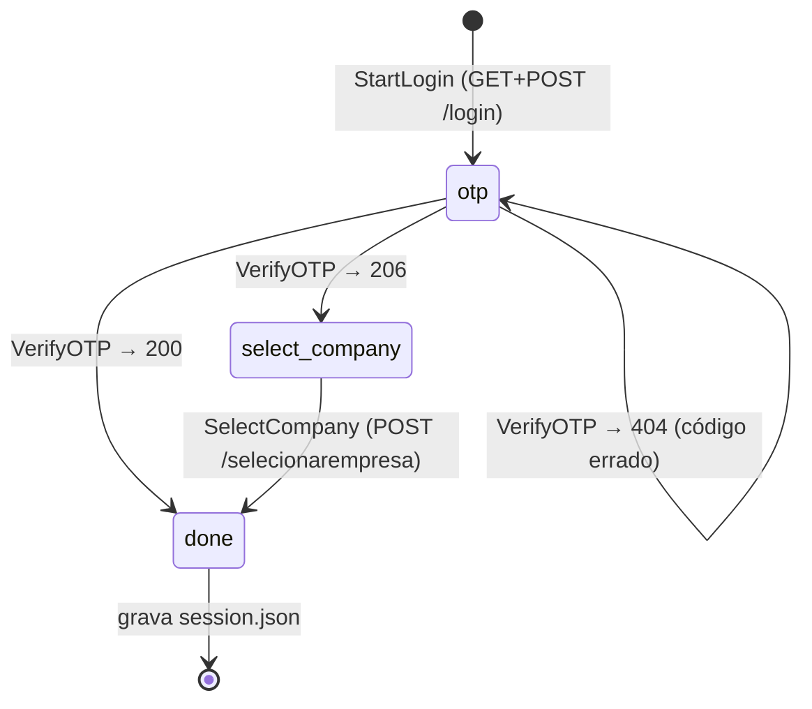

# CLI (`ctbz`)

Uso e instalação estão no [README principal](../../README.md). Aqui fica o funcionamento
interno.

## Estrutura

```text
cmd/ctbz/
  main.go        subcomandos (status, empresa, api, logout), re-login automático, saída
  login.go       orquestração do login: retomada, fontes de OTP, escolha de empresa
internal/ctbz/
  client.go      HTTP: cookies manuais, redirecionamentos manuais, API(), erros
  login.go       etapas do login e parsers de HTML/localStorage
  session.go     persistência (session.json, pending.json)
internal/otp/
  otp.go         extração de 6 dígitos, comando com polling, prompt
scripts/
  otp-gmail-gws.sh       OTP a partir do Gmail (gws)
  extrair-endpoints.py   gera docs/api/catalogo.md
```

Só biblioteca padrão, mais `golang.org/x/term` (detectar terminal). A versão de
`x/term` está fixada em `v0.30.0` para manter o mínimo em Go 1.24; versões mais novas
exigem Go 1.26.

## Máquina de estados do login



`LoginState` (stage, token anti-CSRF, cookies, e-mail mascarado, horário do envio,
empresas) é serializável. Sempre que falta uma entrada (OTP ou CNPJ) e não há terminal
nem `CTBZ_OTP_CMD`, o estado vai para `pending.json` e o processo sai com código 3. A
próxima chamada com `--otp` ou `--cnpj` retoma do ponto exato, com os mesmos cookies.

Regras de retomada (`cmd/ctbz/login.go`):

- `--otp N` só faz sentido retomando: sem login pendente, é erro (o código pertence ao
  login que o gerou).
- `--cnpj X` retoma um login pendente na etapa de seleção de empresa; em qualquer outro
  caso, inicia um login novo já com a empresa definida.
- `--restart` descarta o pendente e começa de novo (novo e-mail).
- O OTP vindo da linha de comando é usado uma única vez; se for recusado, o login
  continua pendente para outra tentativa.

Ordem das fontes de OTP: `--otp` → `--otp-cmd`/`CTBZ_OTP_CMD` → prompt (se stdin for
terminal) → pendente.

## Arquivos de estado

Em `$CTBZ_HOME` (padrão `~/.config/ctbz`), diretório `0700`, arquivos `0600`, gravados
de forma atômica (arquivo temporário seguido de `rename`):

| Arquivo | Conteúdo |
|---|---|
| `session.json` | `base_url`, `cnpj`, `created_at`, `cookies` (`__C`, `oauth-token` com expiração) e `storage` (`l`, `r`, `e` decodificados) |
| `pending.json` | login em andamento: `state` (`LoginState`) e `wanted_cnpj` |

As credenciais (`CTBZ_USER`, `CTBZ_PASSWORD`) nunca são gravadas.

## Decisões

- **Cookies gerenciados à mão** (`map[string]*http.Cookie`) em vez de
  `net/http/cookiejar`: o jar não permite exportar os cookies com metadados, e é
  preciso serializá-los entre execuções. Cookies vencidos não são enviados; qualquer
  `Set-Cookie` das respostas é absorvido e salvo.
- **Redirecionamentos manuais**: o resultado do login vem no fragmento do `Location`
  (`/login#incorreto`), que se perde se o cliente HTTP segue o redirecionamento sozinho.
- **Corpo do OTP como `text/plain`**, idêntico ao `fetch` do navegador.
- **Detecção de tela por conteúdo** (`localStorage.setItem`, `name="cnpj"`, `id="otp"`,
  `id="form-login"`), na ordem do mais para o menos avançado, já que o status 200 é
  usado por várias telas.
- **`url.PathUnescape`** para o `localStorage`, que vem de `encodeURIComponent`
  (`QueryUnescape` trocaria `+` por espaço).
- **Re-login automático** só com `CTBZ_OTP_CMD`: sem ele, um 401 vira erro com
  instrução, em vez de pedir um OTP no meio de outro comando.

## Códigos de saída

| Código | Situação |
|---|---|
| 0 | sucesso |
| 1 | erro (inclui HTTP ≥ 400 no `ctbz api`, que ainda imprime o corpo) |
| 2 | uso incorreto (comando desconhecido, sem argumentos) |
| 3 | login pendente: falta OTP ou CNPJ |

## Testes

```sh
go test ./...
```

- `internal/ctbz`: servidor `httptest` que imita as telas reais (com dados fictícios):
  senha errada → `#incorreto`, OTP errado → 404, seleção de empresa, decodificação do
  `localStorage` com acentos e símbolos, 401 sem cookies.
- `internal/otp`: extração do código, polling com falhas seguidas de sucesso, timeout
  preservando o último erro útil, prompt.
- `cmd/ctbz`: fluxo completo com `--otp-cmd` e fluxo em etapas (pendente → `--otp` →
  pendente → `--cnpj`).
